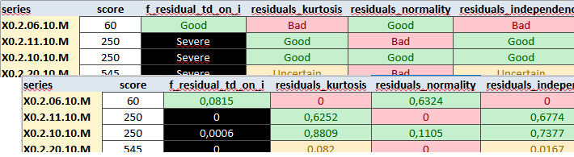

# Part 2: Building a production process {.unnumbered}

```{r}
#| echo: false
#| eval: true
#| warning: false
#| labl: "loading-packages"

library("ggplot2")
library("dplyr")

library("rjd3toolkit")
library("rjd3x13")
library("rjd3providers")
library("rjd3workspace")
library("rjd3production")
```


## Two approaches

JDemetra+ allows to use of seasonal adjustment algorithms via R packages or the graphical user interface (GUI). The use of the GUI is generally motivated by a subsequent manual fine-tuning step, which is greatly facilitated by an organized view of the results and diagnostics, as well as the ability to modify specifications in a guided manner. However, using the GUI does not require the user to perform all operations manually with the mouse. There are two ways to automate the process: the *Cruncher* can be used to run estimations and export outputs, while the rjd3production and rjd3workspace packages can be used to bulk operations such as customizing specifications.

Producers who make little or no use of manual fine-tuning are increasingly inclined to use R functions directly and therefore only manipulate TS (Time Series) objects, freeing themselves from the *workspace* structure. However, these two approaches are not mutually exclusive; it is entirely possible to recreate a functional *workspace* (readable by the GUI and crunchable) from R objects.

In the rest of this section, we will first look at the case of using the GUI, then discuss the case of using R packages exclusively.

## Using the graphical user interface

Using the GUI therefore requires organization into *workspace*(s). These can be created [manually 🔗](https://jdemetra-new-documentation.netlify.app/t-gui-sa-modelling-features#how-to-create-a-workspace) or via an R script, based on the following code

```{r}
#| eval: false
#| echo: true

library("rjd3workspace")

# Creation of a workspace and SA-Processing
my_ws <- jws_new()
jsap1 <- jws_sap_new(my_ws, "sap1")

# Filling in with sa-item
y <- rjd3toolkit::ABS$X0.2.09.10.M # raw series
add_sa_item(jsap1, name = "serie_1", x = y, rjd3x13::x13_spec())

# Saving the workspace as an .xml file readable with the GUI
save_workspace(my_ws, "C:/my_folder/workspace_test.xml")
```

### Selection and assignment of a set of calendar regressors

As a preliminary step to estimation, the selection of calendar regressors consists of determining which set of provides the best correction for each series. To do this, we suggest following these steps:

-   Create a set of regressors to test, as detailed in Attal-Toubert [-@attal2012regresseurs] and illustrated in [appendices 🔗](#crea-regs)

-   run automatic seasonal adjustment (possibly keeping a relevant predefined set of outliers, for example those corresponding to the COVID period) for all the pre-selected sets of regressors

-   note the relative effectiveness of each set by penalizing residual trading days effects

-   choose the set with the best score

A function in the {rjd3production} package covers these steps and returns a table where to each input series corresponds the best set.

```{r}
#| eval: false
#| echo: true

my_context <- create_insee_context()
my_context$variables <- my_context$variables[c("REG1", "REG1_LY", "REG6", "REG6_LY")]
td_table <- select_regs(my_series, context = my_context)
```

-   assign the selected set to each series of the *workspace* by declaring it in the corresponding specification

```{r}
#| eval: false
#| echo: true

assign_td(td = td_table, jws = my_ws)
```

### Customization of specifications

Beyond the choice of a set of calendar regressors, each series is likely to have specific characteristics that the producer wishes to impose: pre-specified outliers, a decomposition scheme, or an estimation period are the most common examples. This customization can be done via the graphical interface for a small number of series or may require the execution of a script in the case of a large number of series.

In the following example, we modify one SA-Item (`jsai`):

```{r}
#| eval: false
#| echo: true
library(rjd3workspace)

# reading the *workspace* 
jws <- jws_open("C:/my_folder/workspace_test.xml")

# retrieving the sa-item in the *workspace* (here the first of the first SA-processing)
jsap <- jws_sap(jws, 1L)
jsai <- jsap_sai(jsap, 1L)

spec0 <- get_domain_specification(jsai)

spec1_with_outliers <- rjd3toolkit::add_outlier(
    x = spec0,
    type = c("AO", "AO", "LS"),
    date = c("2020-02-01", "2020-03-01", "2014-08-01")
)

spec2_with_new_span <- rjd3toolkit::set_basic(spec1_with_outliers, type = "From", d0 = "2012-01-01")

spec3_with_td <- rjd3toolkit::set_tradingdays(
    spec2_with_new_span,
    option = "UserDefined",
    uservariable = c("REG1.group_1", "REG1.group_2"),
    test = "None"
)

set_domain_specification(jsap, 1L, spec3_with_td)
```

Here we assign pre-specified sets of outliers to an entire *workspace* :

```{r}
#| eval: false
#| echo: true

assign_outliers(outliers = outliers_table, jws = my_ws)
```

Outliers can be stored in an "\*.yaml" file or imported from en existing *workspace*.

It is also possible to retrieve X13-Arima or Tramo-Seats specifications from X13-Arima-Seats software and make them compatible with JDemetra+. We describe this migration procedure in [appendices 🔗](#mig-to-jd).

### Estimation

Once the specifications have been set in their initial version, before any modification based on the diagnostics, the estimation can be launched manually in the graphical interface. It is very common to automate this step with the *Cruncher*, which will directly export the output (series and diagnostics). This avoids opening the GUI by running the code below:

```{r}
#| eval: false
#| echo: true

library("rjwsacruncher")
cruncher_and_param(
    workspace = "C:/my_folder/my_ws.xml",
    rename_multi_documents = FALSE,
    policy = "complete"
)
```

A subdirectory /output is created in the *workspace* directory with the files containing the series and the file containing the diagnostics and parameters (demetra_m.csv). The objects to be exported are selected by setting options in R. The corresponding code can be viewed [here 🔗](https://jdemetra-new-documentation.netlify.app/t-production-tools-Cruncher-qr).

In the example above, the policy is “complete” (or “concurrent”), which is the only choice possible for an initial estimation. We will return to this parameter and the various refresh policies available in the [third part 🔗](#camp-infra) in more detail.

Although it is possible to organize series into several SAProcessings in a JDemetra+ *workspace*, it should be noted that the *Cruncher* will always act on an entire *workspace*.

The path to the physical location of the data must be specified. This [link is entered in the *workspace* 🔗](#sec-concept-metadata) when the data is assigned to it. If the data has been moved before the estimation is updated, the path must be updated. This can be done with the following functions in the case of an Excel workbook:

```{r}
#| eval: false
#| echo: true

# Loading the workspace
my_ws <- jws_open("C:/my_folder/workspace_test.xml")

# Updating the path for the first SA-Processing
spreadsheet_update_path(
    jws = my_ws,
    new_path = "C:/my_data/My_Series.xlsx",
    idx_sap = 1
)
# Saving the workspace (wrinting the file on the disk)
save_workspace(my_ws, "C:/my_folder/workspace_test.xml")
```

The case of a “.txt” or “.csv” file is illustrated [here 🔗](https://rjdverse.github.io/rjd3workspace/reference/txt_update_path.html).

### Quality Report

A quality report is constructed by assigning each series a score based on diagnostics selected from the JDemetra+ output. This makes it possible to quickly identify the series with the poorest statistical quality and thus target manual fine-tuning. The statistical score can also be weighted by the importance of the series in the dissemination process to achieve an even more pragmatic selection.

The {JDCruncheR} package produces this report based on the diagnostics and parameters in the “demetra_m.csv” file generated by the rjwsacruncher::cruncher_and_param function. This file can also be generated directly via the GUI using [drop-down menus 🔗](https://jdemetra-new-documentation.netlify.app/t-gui-output).

```{r}
#| eval: false
#| echo: true

BQ <- JDCruncheR::extract_QR("C:/Workspaces/my_ws/Output/SAProcessing-1/demetra_m.csv")
```

The extraction parameters are detailed in the documentation for the [`extractQR` 🔗](https://inseefr.github.io/JDCruncheR/reference/extract_QR.html) function.

A set of diagnostics, detailed in the [appendices 🔗](#ind-bq-r), relating in particular to residual seasonality, residual trading day effects, and the whiteness of the residuals, are selected. Each of these is assigned a rating (“Good,” “Uncertain,” “Bad,” or “Severe”) according to thresholds that can be viewed using the option below:

```{r}
#| eval: false
#| echo: true

library("JDCruncheR")
getOption("jdc_thresholds")
```

These thresholds can be configured using the [`JDCruncher::set_threshold()` 🔗](https://inseefr.github.io/JDCruncheR/reference/set_thresholds.html) function.

Each modality corresponds to a grade, so (“Good,” “Uncertain,” “Bad,” or “Severe”) will become (0, 1, 3, 5). The score for a series is the weighted average of its scores, and its quality is lower when the score is higher. The residual seasonality tests on the seasonally adjusted series and on the irregular have the highest weights. The complete score equation is detailed in the [appendices 🔗](#eq-score).

This equation can also be configured with the `score_pond` argument of the [compute_score() 🔗](https://inseefr.github.io/JDCruncheR/reference/compute_score.html) function.

The result can be exported to Excel, where it is organized as follows by default:

-   a sheet with the diagnostic methods for each series

-   a sheet with the values, including the score, the weighted score, and the main contributions to the score

The user can enrich this file and document the manual fine-tuning of the *workspace*. Sorting by descending (weighted) score yields the expected selective editing.

Below is an excerpt from the Excel export of the quality report, by default:



Guided by the quality report, the producer modifies the specifications to improve seasonal adjustment, generally using the graphical interface. To generate the final output, particularly the series, they can restart the *Cruncher*, no longer with the policy="complete" option but using a refresh that re-estimates only the coefficients of the pre-adjustment model (“policy=regarimaparmeters”) and retains all of the user's modifications. We provide more details on this point in the [appendices 🔗](#comp-refresh).

```{r}
#| eval: false
#| echo: true

library("rjwsacruncher")
cruncher_and_param(
    workspace = "C:/my_folder/my_ws.xml",
    rename_multi_documents = FALSE,
    policy = "regarimaparameters"
)
```

## Using only R packages

All of the steps described above can be performed without using a *workspace* structure and remaining in the R environment.

### Estimation

In this case, we use the functions [`rjd3x13::x13()`{.r} 🔗](https://rjdverse.github.io/rjd3x13/reference/x13.html) (or [`rjd3tramoseats::tramoseats()`{.r} 🔗](https://rjdverse.github.io/rjd3tramoseats/reference/tramoseats.html)) to perform the estimations. Estimation functions work on one TS object which will require to set up loops or "lapply" type functions.

```{r}
#| eval: false
#| echo: true

# for one series 
mod <- x13(my_series, my_spec)
str(mod)
```

### Diagnostics and specifications

In R, you can access the same diagnostics as from the GUI and the *Cruncher* by navigating through the object produced by the estimation (list of lists), which you can directly organize into a customized quality report. To take advantage of the existing formatting, simply rewrite a crunchable *workspace* and regenerate the same report as in the GUI approach. To remain in one environment, manual modification of the specifications based on the diagnostics will in this case be done directly in the R script, as in the example below:

```{r}
#| eval: false
#| echo: true

spec0 <- rjd3x13::x13_spec()

spec1_with_outliers <- rjd3toolkit::add_outlier(
    x = spec0,
    type = c("AO", "AO", "LS"),
    date = c("2020-02-01", "2020-03-01", "2014-08-01")
)
```

<!-- Should you need to apply a customized modification to the whole data set -->

<!-- CODE ? -->

The loop of reading diagnostics and modifying parameters is less fluid, which encourages the use of the graphical interface approach in cases requiring intensive manual fine-tuning. To update specifications in R based on diagnostics, scripts must be modified directly, which is slower and more prone to error for analysts, especially those unfamiliar with R. The R-only approach makes storing and versioning specifications more complex.

The diagnostics used to construct the score presented above can be obtained directly in R, which allows the selective editing procedure to be replicated. The code for obtaining this output can be found in the [appendices 🔗](#ind-bq-r).

The R approach also eliminates any portability issues, even though updating the link between a *workspace* and the data is now simple and reliable.

## Performance {#perf}

We compared the performance of the two approaches. The graph below shows the computation times for seasonally adjusting a dataset, with outlier detection and calendar effect estimation with a preselected set of regressors, using the R packages (v2 and v3) or the cruncher (v2 or v3):

```{r}
#| echo: false
#| eval: true
#| label: "graph-perf"
#| fig-width: 8
#| fig-height: 5
#| fig-dpi: 500

read.table(
    file = "Data/time.csv",
    sep = ";",
    dec = ".",
    header = TRUE,
    encoding = "UTF-8"
) |>
    filter(nb_years == 15, nb_series != 100) |>
    ggplot(data = _, aes(x = nb_series, fill = method, y = time)) +
    geom_bar(stat = "identity", position = "dodge", width = 120) +
    labs(
        fill = "Method",
        x = "Number of series",
        y = "Time (in seconds)",
        title = paste0("Computation time"),
        subtitle = "Datasets of 50, 100, 250, 500, 750 and 1000 series, 15-year long"
    ) +
    scale_x_continuous(breaks = c(50, 250, 500, 750, 1000)) +
    scale_fill_viridis_d()
```

For a series number close to one thousand, the estimation with `rjdx13` takes less than three minutes, which is still very reasonable for most users but far behind the *Cruncher*, which completes the same process in about twenty seconds.

Once the production process is in place, it is recommended to validate or adjust the settings annually and to adopt an infra-annual production strategy, generally monthly or quarterly, allowing the seasonally adjusted data to be updated when new raw data becomes available. This issue is tackled in the next part.
