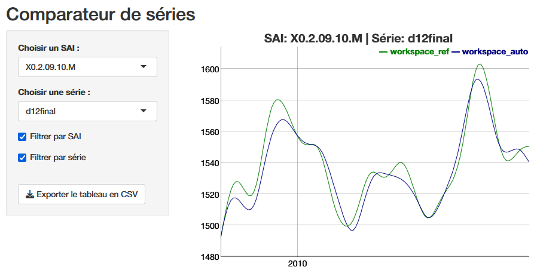

# Part 3: Infra-annual and annual campaigns {.unnumbered}

### Infra-annual campaigns {#camp-infra}

The objective of an infra-annual campaign is to quickly produce an updated SA series when a new raw data point is available and the recent past of the  series may be revised. The seasonally adjusted series has two sources of revision: the raw data and changes to the final seasonal factor estimation models. The seasonal adjustment guidelines recommend minimizing these so-called technical revisions (see Chapter 6). A common method for achieving this objective is to use the predicted seasonal factors, including the predicted calendar effect, calculated during the last annual campaign. However, JDemetra+ also offers a continuum of refresh methods that allow to gradually loosen the constraints on the pre-adjustment and control the revisions of the linearized series before the decomposition step, which will be completely redone. All of these refresh policies are presented in the [documentation](https://jdemetra-new-documentation.netlify.app/a-rev-policies), among which the “lastoutliers” option is particularly recommended. In this case, we allow ourselves to re-identify the outliers over the last year. Manual fine-tuning in the infra-annual context will focus on revisions and therefore outliers, avoiding too many parameter changes. This refresh is possible from the graphical interface, with the *Cruncher* by specifying the “policy” argument of the [`rjwsacruncher::cruncher_and_param()`{.r}](https://aqlt.github.io/rjwsacruncher/reference/cruncher_and_param.html) function but also directly in R with the functions `rjd3x13::x13_refresh()`{.r} or `rjd3tramoseats::tramoseats_refresh()`{.r}. 

For infra-annual estimation with the *Cruncher*, the following R code can be used:

```{r}
#| eval: false
#| echo: true

library("rjwsacruncher")
cruncher_and_param(
    workspace = "C:/my_folder/my_ws.xml",
    rename_multi_documents = FALSE,
    policy = "lastoutliers"
)
```

Table 4: Implementation of a refresh policy

| Data type | Tools |
|------------------------------------|------------------------------------|
| Workspace | \- GUI [(Drop-down menus)](https://jdemetra-new-documentation.netlify.app/a-rev-policies#implementation-in-gui)[🔗](#refresh-R) |
|  | \- [`rjwsacruncher::cruncher_and_param(..., policy= ,)`{.r}](https://aqlt.github.io/rjwsacruncher/reference/cruncher_and_param.html) |
|  | \- [`rjd3workspace::jws_refresh()`{.r}](https://rjdverse.github.io/rjd3workspace/reference/refresh.html) |
| TS objects in R | \- [`rjd3x13::x13_refresh()`{.r}](https://rjdverse.github.io/rjd3x13/reference/refresh.html) |
|  | \- [`rjd3tramoseats::tramoseats_refresh()`{.r}](https://rjdverse.github.io/rjd3tramoseats/reference/refresh.html) |

The use of forecast seasonal coefficients ($S\_{f}$) simply requires exporting them at the end of the installation process, then at the end of each annual campaign, in order to perform the calculation: $Y_{sa}=Y_{raw}-S_{f}$ or $Y_{sa}=Y_{raw} / S_{f}$, in the case of a multiplicative model. To potentially take into account a revision of the recent past of the raw series, exporting past coefficients is also useful. The series of forecast coefficients can be generated by the *Cruncher* by specifying it in the options, as shown below

```{r}
#| echo: true
#| eval: false
#| label: "set-option-ts-series"

options(default_tsmatrix_series = c("sa", "sa_f", "s", "s_f"))
```

or in R by defining a user-defined output as shown below

<!-- If the SA series is generally updated with projected seasonal factors outside of JDemetra+, in order to minimize the tools used, this operation can also be performed in a *workspace* by blocking the re-estimation span on the date of the last annual campaign or installation of the process, while continuing to update the data. However, it is necessary to determine the desired behavior in the event of a revision of the recent past by selecting the appropriate refresh policy. -->

```{r}
#| echo: true
#| eval: false
#| label: "x13-ud"

mod <- x13(y, userdefined = c("s", "s_f"))
str(mod$user_defined)
```

### Annual campaigns {#camp-an}

An annual campaign consists of updating seasonal coefficient estimation models to verify that the parameters used do indeed produce seasonally adjusted series with the required properties (absence of residual seasonality, absence of residual calendar effects, etc.).

This update can be done by comparing the current or reference models used up to the time of the campaign with an automatic estimate. In most cases, the automatic estimation will be constrained by past parameters such as the selection of calendar regressors or certain pre-specified outliers, particularly those from the COVID period. For ease of comparison, it may be useful to calculate the quality report scores described in Part 2 for the “reference” or "current" *workspace* and the “automatic” *workspace*. A lower score for the automatic estimate means that this is preferable, and a new *workspace* (“working”) can then be created by merging the "current" and “automatic” *workspaces*, as detailed in the [appendices](#fusion-ws).

This approach requires working on comparable raw series. If these have undergone significant revisions (re-basing, change of source, etc.), we return to an approach similar to the installation of a new process.

Main steps:

-   Update the reference *workspace* (“ref”) using the new raw data and statistical parameters from the previous annual campaign, possibly modified by the same strategy as a sub-annual campaign (e.g., “lastoutliers”).

-   Automatic estimation (“auto”) on the new raw data, probably maintaining certain parameters (set of calendar regressors, some or all of the outliers “pre-specified” by the user, etc.)

-   calculation of scores for the two *workspaces* “ref” and “auto”

-   merging of the “auto” and “ref” *workspaces* into a new ‘working’ *workspace* according to the score value of each series

-   editing of a quality report on the “working” *workspace*

-   Manual review with selective editing, as in the installation phase

-   Generation of the final output with the *Cruncher*, as in the installation phase

If forecast coefficients are used during infra-annual campaigns, the *workspace* from the previous annual campaign can be updated with a policy "last outliers" to return to the case described above.

Details on how the data is organized and code snippets are provided in the [vignette {rjd3production} package 🔗](https://inseefr.github.io/rjd3production/articles/process.html).

### Numerical impact of a change in parameters

In light of the (bad) diagnostics, identified in particular through the quality report, the producer can intervene to modify the parameters and improve the statistical quality of the adjustment. For example, they can modify a set of calendar regressors and eliminate the residual calendar effects that they had previously observed. Beyond improving statistical test results, it is often useful to visualize the numerical impact of a parameter change or re-estimation, which allows revisions to be quantified and visualized, but also certain settings to be validated, particularly the choice of outliers based on “expert knowledge.” Exporting the series produced is one solution, but if you want to make these comparisons before you have finished working on a *workspace*, you can use the [`compare()`{.r}](https://inseefr.github.io/rjd3production/reference/compare.html) function from the rjd3production package, which avoids generating intermediate outputs. This allows you to read the series directly in two or more *workspaces*, each corresponding to a version of the parameters or a state of the estimate, as shown in the following code:

```{r}
#| echo: true
#| eval: false
#| label: "code-compare"

df <- compare(path_ws_ref, path_ws_work)
run_app(df)
```

The function launches a shiny application that provides a graphical comparison, below is the final trend (d12), and the ability to download the series values to analyse the revisions.



## Conclusion

Ensuring the statistical quality of seasonally adjusted series requires the implementation of a production process that, in light of diagnostics, allows for easy and large-scale customization of estimation parameters. The use of the open-source software JDemetra+ and its R tools makes it possible to achieve this goal by offering various automation options while providing access to detailed manual fine tuning. We have seen that the decision to integrate the graphical user interface into a production process is fundamental to the organization of data. The main reasons for this should be the use of manual fine-tuning and performance. However, an organization based solely on R does not exclude ad hoc use of the GUI or *Cruncher*. The organization of operations and the use of tools as described in this article are, of course, only suggestions, which we hope will provide practical answers to the many producers of SA series who wish to use JDemetra+.

In order to communicate with their users, they often need reporting tools that break down the effects of seasonal adjustment on changes in a given series, in particular to highlight the various contributions to revisions. Such tools are often *in-house*, but there are packages or plug-ins linked to JDemetra+, often still in version 2, that allow to display this type of information. It would be interesting to follow up on this article by offering a review of open-source reporting tools and making available an R package that allows users to take full advantage of version 3 of JDemetra+.

\pagebreak
