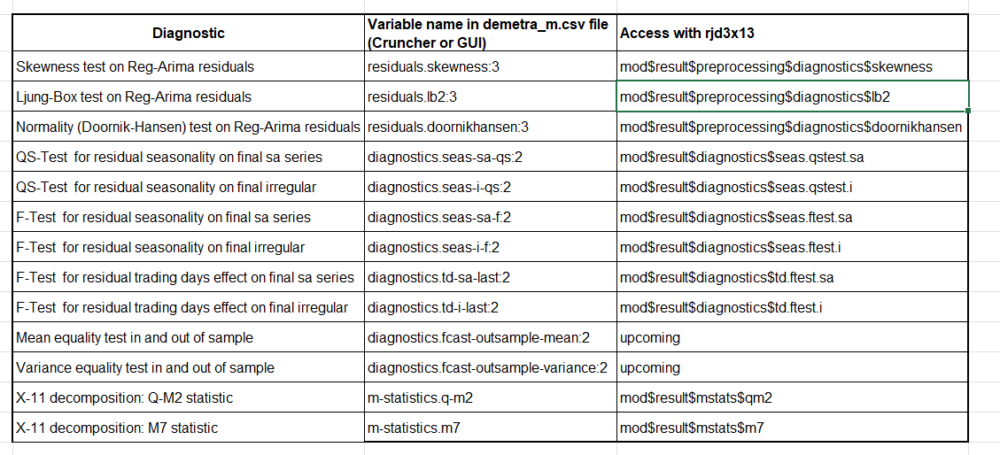

# Appendices {.unnumbered}

```{r}
#| echo: false
#| eval: true
#| warning: false
#| labl: "loading-packages"

library("ggplot2")
library("dplyr")

library("rjd3toolkit")
library("rjd3x13")
library("rjd3providers")
library("rjd3workspace")
library("rjd3production")
```


## Calendar effect correction {#crea-regs}

There are two possible procedures for generating calendar regressors: creating customized regressors as shown below, or using predefined regressors in JDemetra+, which also requires defining a reference calendar. Version 3.x of the GUI allows you to automatically \[select 🔗)(https://jdemetra-new-documentation.netlify.app/a-sa-pre-treatment#calendar-correction) from the predefined regressor sets, based on statistical tests.

Instead of a simple [national calendar 🔗](https://jdemetra-new-documentation.netlify.app/a-calendar-correction#national-calendar), JDemetra+ allows you to create [“chained” 🔗](https://jdemetra-new-documentation.netlify.app/a-calendar-correction#chained-calendar) or [“composite” 🔗](https://jdemetra-new-documentation.netlify.app/a-calendar-correction#composite-calendar) with the GUI or [rjd3toolkit 🔗](https://rjdverse.github.io/rjd3toolkit/reference/index.html#calendars).

### Creating a reference calendar

To create a French calendar based on French public holidays, you can use the [`create_french_calendar()` 🔗](https://inseefr.github.io/rjd3production/reference/insee_modelling.html) function from the {rjd3production} package:

```{r}
#| eval: true
#| echo: true

cal_FR <- create_french_calendar()
```

This function can be adapted to any national calendar.

### Generation of regressor sets

Using the French calendar, it is possible to generate calendar regressors based, for example, on the usual groupings used by INSEE:

```{r}
#| eval: true
#| echo: true

regs <- create_insee_regressors(start = c(2000, 1), frequency = 12, length = 360)
sets <- create_insee_regressors_sets(start = c(2000, 1), frequency = 12, length = 240)
names(sets)
```

## Quality Report: Diagnostics and R Code {#ind-bq-r}

Diagnostics selected by default when using X-13-Arima\footnote{When using Tramo-Seats, this also works, but in this version, the diagnostics specific to X-13-Arima are simply removed and not replaced} are as follows:

Table A1: Diagnostics



In R, the diagnostics are extracted from the “model” object containing all the estimation results and obtained with the code below.

```{r}
#| eval: false
#| echo: true

model <- x13(my_series, my_spec)
str(model)
```

More information on the tests is available in the [documentation 🔗](https://jdemetra-new-documentation.netlify.app/m-tests)

### Score equation {#eq-score}

$$
\begin{aligned}
score\_total &= 30 * grade\_qs\_residual\_s\_on\_sa\\
&+ 30 * grade\_f\_residual\_s\_on\_sa\\
&+ 30 * grade\_f\_residual\_td\_on\_sa\\
&+ 20 * grade\_f\_residual\_td\_on\_i\\
&+ 20 * grade\_qs\_residual\_sa\_on\_i\\
&+ 20 * grade\_f\_residual\_sa\_on\_i\\
&+ 15 * grade\_oos\_mean\\
&+ 10 * grade\_oos\_mse\\
&+ 15 * grade\_residuals\_independency\\
&+ 5 * grade\_residuals\_skewness\\
&+ 5 * grade\_residuals\_homoskedasticity\\
&+ 5 * grade\_q\_m2\\
&+ 5 * grade\_m7
\end{aligned}
$$

## Annual campaign: comparison of workspaces

### Creation of WS_work {#merge-ws}

The **WS_work** is a merger between **WS_ref** and **WS_auto**. A score is calculated for both workspaces and, for each series, the SA-Item is retrieved from the workspace with the lowest score between WS_auto and WS_ref.

In an annual campaign process, we will use the [`transfer_sa_item()`{.r} 🔗](https://rjdverse.github.io/rjd3workspace/reference/transfer_sa_item.html) function from {rjd3workspace} to merge **WS_ref** and **WS_auto**.

```{r}
#| eval: false
#| echo: true

# save WS_ref as initial version of WS_work
WS_auto <- load_workspace(file = "./WS/WS_auto.xml")
WS_work <- load_workspace(file = "./WS/WS_work.xml")

sap1_auto <- .jws_sap(jws = WS_auto, idx = 1)
sap1_work <- .jws_sap(jws = WS_work, idx = 1)

# update ws_work with sa-items from ws auto when necessary 
transfer_series(
    jsap_from = sap1_auto,
    jsap_to = sap1_work,
    selected_sa_items = c("RF0610", "RF0620")
)

save_workspace(jws = WS_work, file = "./WS/WS_work.xml")
```

## Refreshing data in R data {#refresh-R}

In version 3 of JDemetra+, refresh policies can also be applied directly in R and no longer only via the GUI or the cruncher, as was the case in version 2.

### TS Objects

In the object (list of lists) containing the estimation results in R, you can extract the `estimationSpec` and `resultSpec` (or `pointSpec`) The refresh policy will allow you to remove certain constraints in the `estimationSpec`, in the example below to re-identify outliers from January 1, 2017.

```{r}
#| eval: false
#| echo: true

library("rjd3x13")
# estimate a model
sa_x13_v3 <- rjd3x13::x13(y_raw, spec = "RSA5")
current_result_spec <- sa_x13_v3$result_spec
current_domain_spec <- sa_x13_v3$estimation_spec

# generate NEW spec for refresh
refreshed_spec <- x13_refresh(
    current_result_spec, # point spec to be refreshed
    current_domain_spec, # domain spec (set of constraints)
    policy = "Outliers",
    period = 12, # monthly series
    start = "2017-01-01",
    end = NULL
)

# apply the new spec on new data : for example y_new= y_raw + 1 month
sa_x13_v3_refresh <- x13(y_new, refreshed_spec)
```

### Workspaces

It is possible to refresh a workspace or SA-Processing without using either the Cruncher or the GUI with the `jsap_refresh()`{.r} and `jws_refresh()`{.r} functions from the rjd3workspace package.

```{r}
#| eval: false
#| echo: true

ws <- jws_open(file = ws_path)
jws_refresh(jws = ws, policy = "lastoutliers")
save_workspace(jws = ws, file = ws_path)
```

## Additional information on specifications {#comp-specs}

### Modification

-   `domainSpec` (or Reference Specification)

Modification in the GUI:

{width="90%" height="60%"}

Using this same menu, you can apply the Reference Specification or the Result Specification to a series.

En R :

```{r}
#| eval: false
#| echo: true

library("rjd3workspace")
set_domain_specification(jsap, 1L, new_domain_spec)
```

-   `estimationSpec`

Modification in GUI:

{width="90%" height="60%"}

In R :

```{r}
#| eval: false
#| echo: true

library("rjd3workspace")
set_specification(jsap, 1L, new_estimation_spec)
```

-   `pointSpec` (or Result Specification)

Estimation result can be applied as indicated above.

```{r}
#| eval: false
#| echo: true

library("rjd3workspace")

jws_compute(jws)
read_workspace(jws, compute = TRUE)
read_sap(jsap)
read_sai(jsai)
```

### Refresh policy behavior {#comp-refresh}

The estimation is made using the latest estimationSpec, but a refresh policy aims to remove all or part of the constraints of the `estimationSpec` and return to the `domainSpec`.

-   The “concurrent” policy returns to the `domainSpec` by deleting user-defined parameters not written in the domain spec (difference in behavior compared to version 2 of JDemetra+: changes made via the specification window on the right are deleted).

-   “concurrent” refresh deletes the outliers pre-specified in the `estimationSpec` (for example, in the GUI via the specification window on the right), which corresponds to a modification of the `estimationSpec`; all outliers will be re-identified

-   Refresh “lastoutliers” deletes the outliers pre-specified in the `estimationSpec` over the last year (or other defined span), and a re-identification will be performed over this period.

This allows the user to differentiate between permanent settings (`domainSpec`) and temporary settings (`estimationSpec`).

### Example

Here is a common procedure for updating data in the case of a sub-annual campaign with output generation using the cruncher. Please note that you must save the workspace before performing a “refresh.”

-   New raw data is available (new points and revision of the recent past).

-   Use a “refresh last outliers” to benefit from automatic detection

-   Check the results and revisions, and for certain important series, review the automatic detection

-   Open the graphical user interface and modify the `estimationSpec` of a series via the window on the right by adding an outlier $Out_1$ in the last year

-   Apply and save these changes in the GUI

-   Regenerate an output with the cruncher (export the final series)

-   If policy = lastoutliers again: return to the `domainSpec` for the last year, $Out_1$ is lost

-   If you want to keep $Out_1$, use the option policy = “arimaparameters”; the identification does not change, only the coefficients are re-estimated

-   To keep $Out_1$ and re-identify with ‘lastoutliers’ again, you must write $Out_1$ in the `domainSpec` (called “reference specification” in the graphical interface)

### Differences between version 2 and version 3 {#spec-v2-v3}

In JDemetra+ version 2.x, there is no `estimationSpec`. The settings set by the user are therefore necessarily in the `domainSpec` and are therefore never deleted by a refresh policy.

Workspaces created in version 2 can be opened in version 3, but it will no longer be possible to return to version 2.

Copying specifications when a version 2 workspace is opened in version 3:

-   `domainSpec` copied to `domainSpec` and `estimationSpec`
-   `pointSpec` to `pointSpec`

## Data structures

Workspaces are organized into SA-Processing and SA-Item.

#### SA-Processing {#sec-concept-sap}

An SA-Processing (SAP) is represented by an `.xml` file. It contains SA-Items and user-defined reference specifications.

#### SA-Item {#sec-concept-sai}

An SA-Item contains information about a given series:

-   raw data

-   specifications (`pointSpec`, `estimationSpec`, `domainSpec`)

-   metadata

#### Metadata {#sec-concept-metadata}

The metadata (see the <metaData> tag in the `.xml` file corresponding to SA-Processing) contains:

-   the type of source of the raw data

-   the “id” of the file containing the raw data (path and parameters) that will be used to refresh the estimate

-   any comments on the series (generally used to justify a choice of parameters)

### Modelling context {#sec-concept-modelling-context}

The modelling context contains the calendars, variables, and external regressors needed for the estimates made in the workspace.

## Migration to JDemetra+ {#mig-to-jd}

It is possible to convert X-13 specifications used in the US Census Bureau's X-13-Arima-Seats software into JDemetra+ X13-Arima specifications.

This operation is performed using the graphical interface with the [SpecParser 🔗](https://github.com/bbkrd/SpecParser) plug-in, which can only be used in version 2. The workspace containing these specifications can be opened in version 3. The plug-in documentation can be found [here 🔗](https://bbkrd.github.io/pages/specparser/) and all the migration steps are described [here 🔗](https://bbkrd.github.io/pages/specparser/) in the JDemetra+ documentation.
